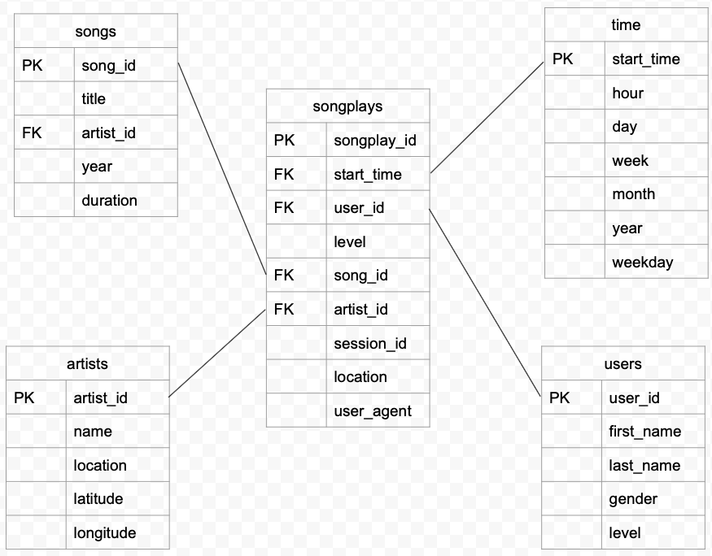
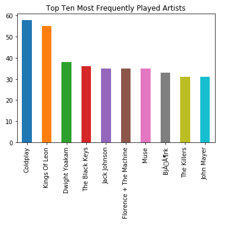

# Sparkify ETL - Star Schema

The object of this project is to provide Sparkify with song play data structured in a way that can be queried by the analytics team for increased understanding about what songs users are listening to.  This is a proof-of-concept project run on a subset of data to demonstrate the concepts of the data structure and the ETL pipeline for testing by the analysts. In this restricted data set 80 song files are processed followed by 30 days of song play log files for each day of November 2018.

The primary focus of the analytics are the songs that users are listening to so the song attributes that exist (title, artist, duration, year) are important to the analysts.  The design of the schema is a star schema with the songplay fact table at its centre.  Dimension tables of song, artist, time and user then enable analysts to write queries which join with the fact table and can be aggregated over a choice of fields.

## Project Files

The project source files include:

- **sql_queries.py**: 
    - Defines the SQL queries to:
        - create the tables
        - insert/update records into the tables
        - drop the tables
- **create_tables.py**: 
    - Establishes a connection to the database then drops and re-creates the required tables.
- **etl.py**: 
    - Processes the input files, performs a small amount of transformation and writes the records to the database tables.

Additional supporting files used during the development of the project source files listed above include:

- **test.ipynb**: Jupyter notebook to test that the data has been written to the tables as expected following the ETL process.
- **etl.ipynb**: Jupyter notebook which walks through the extraction of a subset of song and log data.

## Star Schema - Structure

The overall structure of the data is as shown below:

### Fact Table - songplays

The songplays table is the central fact table of the star schema. Each row holds  data about the start time of the song play, the location of the user and the payment level of the user.  Foreign keys provide join capabilities with the users, songs, artists and time tables.

### Dimension Tables

4 dimension tables are implemented: 

- users: user_id (primary key), first name, last name, gender and payment level
- songs: song_id (primary key), title, year, duration plus foreign key for artist 
- artists: artist_id (primary key) name, location, latitude, longitude
- time: timestamp in milliseconds (primary key), hour, day, week, month, year, day of the week

## Star Schema - Aims and Objectives

The star schema aims to enable the analysts to query the data in a reasonably straightforward and intuitive manner to obtain the information that is required about the playing of songs by users.   The success of the final implementation depends on the completeness of the data in the songs and artists tables which are both sparsely populated in this proof-of-concept phase.

## ETL Pipeline - Aims and Objectives

The ETL pipeline aims to process the data in all of the available files and write them to the database in such a way that 

- all relevant data has been extracted from the source files and written to the relevant database tables
- multiple reads of the same source file or duplicate data will not cause duplicate entries in the database 

Avoidance of duplicates is achieved by the Primary Key constraint which is configured in the database tabless and the use of an ON CONFLICT DO NOTHING statement for each table.  The exception to this ON CONFLICT action is the users table which will update any change to the user payment level.  These actions correctly discard several duplicate songs and artists in the source files and no additional records are written when the etl.py file is executed multiple times.

The choices made in implementing the conflict resolution is a point for discussion with the analysts to ensure that this is the required behaviour.

In a production setting the ETL pipeline would be updated to move processed files out of the existing directory structure so that each traversal of the Data directory processes only new and unprocessed files.

## Example Queries

Example queries are provided below to clarify the data structure.  

### Example Query 1
To obtain all of the song play data for a single date (22nd Nov 2018) the following query can be executed:

`SELECT * ` 
`FROM songplays sp ` 
`JOIN songs s ON s.song_id = sp.song_id ` 
`JOIN artists a on a.artist_id = sp.artist_id ` 
`JOIN users u on u.user_id = sp.user_id ` 
`JOIN time t on t.start_time = sp.start_time ` 
`WHERE t.year=2018 AND t.month=11 and t.day=22 `

### Example Query 2
To obtain an ordered count of the number of times each artist is played in a specific month:

`SELECT t.year as year, t.month as month, sp.artist_id, count(sp.artist_id) as artist_freq ` 
`FROM songplays sp ` 
`JOIN time t on t.start_time = sp.start_time ` 
`WHERE t.year = 2018 AND t.month=11 ` 
`GROUP BY t.year, t.month, sp.artist_id ` 
`ORDER BY t.year, t.month, artist_freq desc`

## Temporary Additional Table

Due to limited song data it was difficult to demonstrate the analysis of the songs users were listening to since songs from the song play logs could not be matched to the songs data table.  In fact, only one songplay record was successfully assigned a valid song_id.  To check that the given schema had potential to support the analysis required by the analysts a temporary table called tmp_song_artist_dur was created to hold the song title, artist title and song duration for each (user_id, start_time) combination in the songplays table.

One of the successful queries run with this data was to show the top 10 artists in terms of frequency in November 2018.  A basic bar plot is shown below.

## Next Steps

- Discuss the conflict resolution steps with analysts
- Implement an additional ETL pipeline step to mark files as processed
- Fully populate the songs database
- Re-process the log files to generate song and artist matches in the song_id and artist_id fields in songplays
- Run analyst test queries
- Remove the temporary tmp_song_artist_dur table and associated python code

